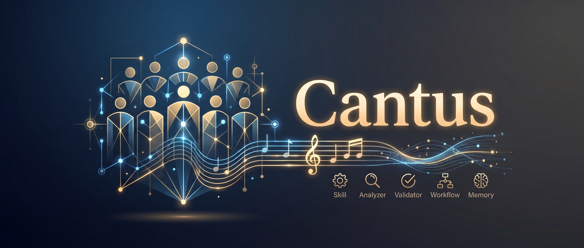
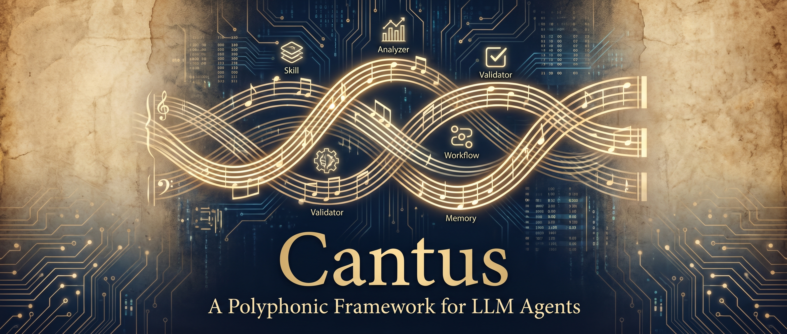

<p align="center">
  
</p>

<p align="center">
  <a href="https://github.com/schola-cantorum/cantus/releases/tag/v0.2.0"></a>
  <a href="LICENSE"></a>
  <a href="https://colab.research.google.com/github/schola-cantorum/cantus/blob/v0.1.4/notebooks/task_template.ipynb"></a>
</p>

<div align="center">

[繁體中文](README.zhTW.md)

</div>

# Cantus

> A polyphonic framework for composing LLM agent harnesses — designed for teaching on Google Colab.

Cantus (Latin: *song*, *chant*) is a teaching-oriented LLM agent framework. Five protocols (Skill / Analyzer / Validator / Workflow / Memory) let learners and operators compose agents on Google Colab, backed by 4-bit-quantised Gemma 4 models.

The Chinese-speaking LLM community refers to prompt engineering as *詠唱* (incantation). Cantus treats agent composition as a polyphonic chant — each protocol is a voice, and together they form an agent that sings back.

## Open in Colab — 5-minute path

The fastest way to experience Cantus is to launch the bundled notebooks directly:

| Notebook | Audience | One-click launch |
| --- | --- | --- |
| `notebooks/task_template.ipynb` | End user — build your first agent | [](https://colab.research.google.com/github/schola-cantorum/cantus/blob/v0.1.4/notebooks/task_template.ipynb) |
| `notebooks/admin_setup.ipynb` | Administrator — mirror Gemma 4 weights to Drive (run once before downstream users) | [](https://colab.research.google.com/github/schola-cantorum/cantus/blob/v0.1.4/notebooks/admin_setup.ipynb) |

See [`notebooks/README.md`](./notebooks/README.md) for the recommended order and tag-pinning conventions.

## Install

```bash
# Pin to a tag (recommended — reproducible)
pip install git+https://github.com/schola-cantorum/cantus@v0.1.4

# Follow main (latest commit)
pip install git+https://github.com/schola-cantorum/cantus@main

# Pin to a commit SHA (bug reproduction)
pip install git+https://github.com/schola-cantorum/cantus@<commit-sha>
```

The runtime extras (Gemma 4 + transformers + bitsandbytes) require:

```bash
pip install 'cantus[runtime] @ git+https://github.com/schola-cantorum/cantus@v0.1.4'
```

## 30-second Quickstart

```python
from cantus import skill, Agent, mount_drive_and_load

@skill
def add(a: int, b: int) -> int:
    """Add two integers."""
    return a + b

model_handle = mount_drive_and_load(variant="E4B")
agent = Agent(model=model_handle)

result = agent.run("What is 17 plus 25?")
print(result.final_answer)
```

## Multi-provider quickstart (v0.2.0)

Tier 2 ChatModel adapters let you point the same Agent at OpenAI or Anthropic instead of local Gemma. **You MUST wrap a `ChatModel` with `ChatModelAsHandle` before passing it to `Agent`** — the Agent only speaks the Tier 1 `.generate(prompt) -> str` protocol.

OpenAI (install `pip install 'cantus[openai]'`, set `OPENAI_API_KEY`):

```python
from cantus import Agent, ChatModelAsHandle, load_chat_model

chat = load_chat_model("openai/gpt-4o-mini")
agent = Agent(model=ChatModelAsHandle(chat, system="You are terse."))
result = agent.run("What is 17 plus 25?")
print(result.final_answer)
```

Anthropic (install `pip install 'cantus[anthropic]'`, set `ANTHROPIC_API_KEY`):

```python
from cantus import Agent, ChatModelAsHandle, load_chat_model

chat = load_chat_model("anthropic/claude-sonnet-4-6")
agent = Agent(model=ChatModelAsHandle(chat, system="You are terse."))
result = agent.run("What is 17 plus 25?")
print(result.final_answer)
```

`cantus[providers]` installs both adapters at once. Google / Groq / NVIDIA adapters land in v0.2.1. cantus intentionally does **not** depend on LiteLLM at any layer.

<p align="center">
  
</p>

## The five protocols (one sentence each)

- **Skill** — a function the agent can call (tool use). Decorate with `@skill` or subclass `Skill`.
- **Analyzer** — turn user input into a structured result before entering the agent loop. Use `@analyzer` or subclass `Analyzer`.
- **Validator** — post-process the agent's output, returning a `Result` that decides pass or retry. Use `@validator` or subclass `Validator`.
- **Workflow** — a fixed flow that chains skills, analyzers, and validators. Use `@workflow` or subclass `Workflow`.
- **Memory** — conversation state and retrieval memory; ships `ShortTermMemory`, `BM25Memory`, `EmbeddingMemory`.

## Documentation

Full docs live in [`docs/`](./docs/):

- [Overview](./docs/overview.md) — architecture and design philosophy
- [Quickstart](./docs/quickstart.md) — from zero to first agent in 10 minutes
- [Protocols](./docs/protocols/) — design and usage of all five protocols
- [Cookbook](./docs/cookbook/) — patterns, error recipes, teaching tips
- [llms.txt](./llms.txt) — priming document for external LLMs
- [Developer LLM Wiki](./docs/llm_wiki/index.md) — internal contributor knowledge base (research, coding style, architecture, future work)

## License

ECL-2.0 — Educational Community License, Version 2.0. See [`LICENSE`](./LICENSE).
